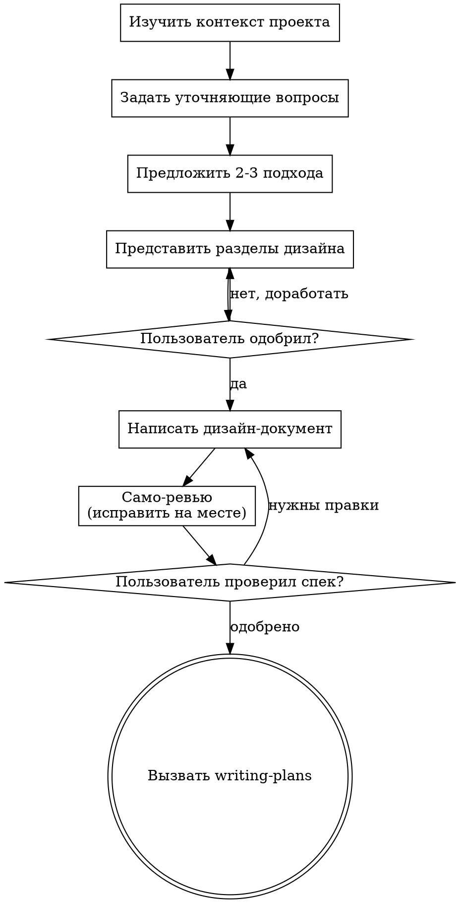

# Схема процесса брейнсторминга

```dot
digraph brainstorming {
    "Изучить контекст проекта" [shape=box];
    "Задать уточняющие вопросы" [shape=box];
    "Предложить 2-3 подхода" [shape=box];
    "Представить разделы дизайна" [shape=box];
    "Пользователь одобрил?" [shape=diamond];
    "Написать дизайн-документ" [shape=box];
    "Само-ревью\n(исправить на месте)" [shape=box];
    "Пользователь проверил спек?" [shape=diamond];
    "Вызвать writing-plans" [shape=doublecircle];

    "Изучить контекст проекта" -> "Задать уточняющие вопросы";
    "Задать уточняющие вопросы" -> "Предложить 2-3 подхода";
    "Предложить 2-3 подхода" -> "Представить разделы дизайна";
    "Представить разделы дизайна" -> "Пользователь одобрил?";
    "Пользователь одобрил?" -> "Представить разделы дизайна" [label="нет, доработать"];
    "Пользователь одобрил?" -> "Написать дизайн-документ" [label="да"];
    "Написать дизайн-документ" -> "Само-ревью\n(исправить на месте)";
    "Само-ревью\n(исправить на месте)" -> "Пользователь проверил спек?";
    "Пользователь проверил спек?" -> "Написать дизайн-документ" [label="нужны правки"];
    "Пользователь проверил спек?" -> "Вызвать writing-plans" [label="одобрено"];
}
```
