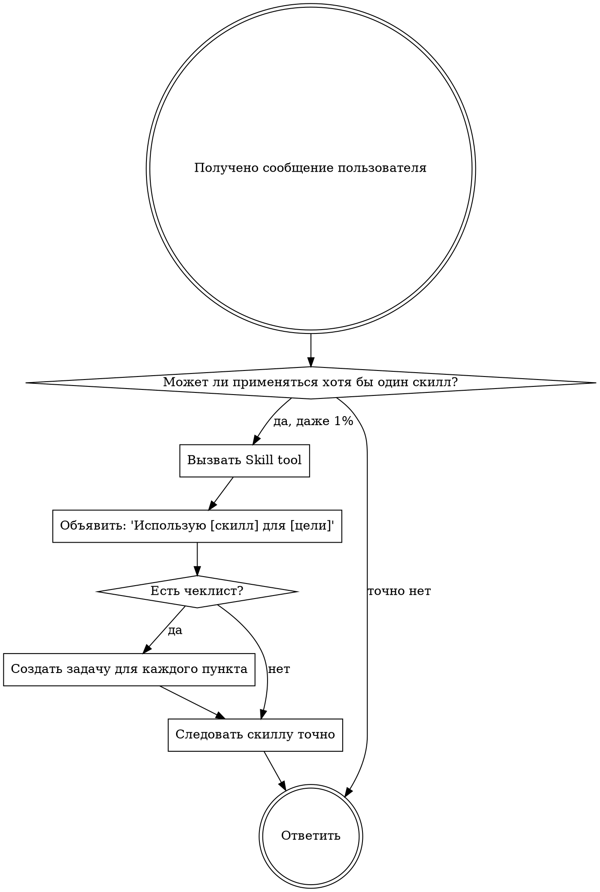

# Схема принятия решений по скиллам

```dot
digraph skill_flow {
    "Получено сообщение пользователя" [shape=doublecircle];
    "Может ли применяться хотя бы один скилл?" [shape=diamond];
    "Вызвать Skill tool" [shape=box];
    "Объявить: 'Использую [скилл] для [цели]'" [shape=box];
    "Есть чеклист?" [shape=diamond];
    "Создать задачу для каждого пункта" [shape=box];
    "Следовать скиллу точно" [shape=box];
    "Ответить" [shape=doublecircle];

    "Получено сообщение пользователя" -> "Может ли применяться хотя бы один скилл?";
    "Может ли применяться хотя бы один скилл?" -> "Вызвать Skill tool" [label="да, даже 1%"];
    "Может ли применяться хотя бы один скилл?" -> "Ответить" [label="точно нет"];
    "Вызвать Skill tool" -> "Объявить: 'Использую [скилл] для [цели]'";
    "Объявить: 'Использую [скилл] для [цели]'" -> "Есть чеклист?";
    "Есть чеклист?" -> "Создать задачу для каждого пункта" [label="да"];
    "Есть чеклист?" -> "Следовать скиллу точно" [label="нет"];
    "Создать задачу для каждого пункта" -> "Следовать скиллу точно";
    "Следовать скиллу точно" -> "Ответить";
}
```
